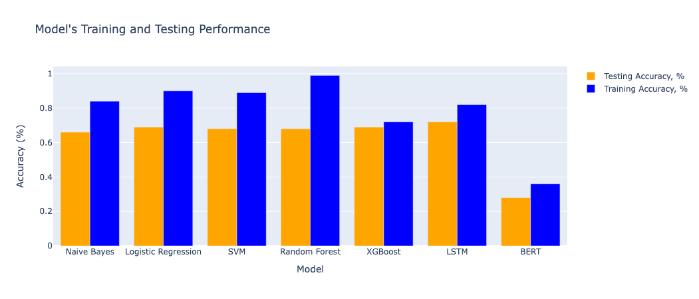
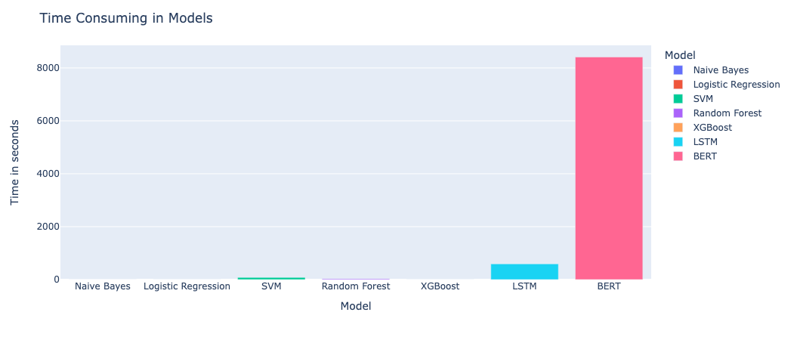
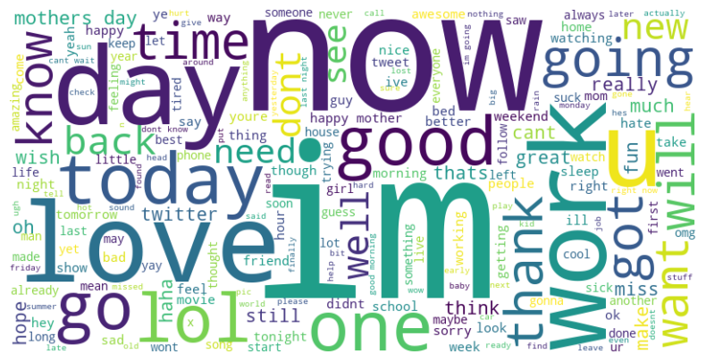

# Twitter Sentiment Analyzer

This project is a Twitter Sentiment Analysis application built using Python. It leverages machine learning techniques, particularly XGBoost, to classify the sentiment of tweets as negative, neutral, or positive. The project also includes a web interface powered by Streamlit, making it easy to interact with the model and visualize the results.

## Connect with Me

- **LinkedIn:** [https://www.linkedin.com/in/mahshidkhatami-data-analyst/](https://www.linkedin.com/in/mahshidkhatami-data-analyst/)
- **Email:** [khatami.mahshid@gmail.com](mailto:khatami.mahshid@gmail.com)
- **Streamlit:** [https://sentimentanalyze-mahshid.streamlit.app/](https://sentimentanalyze-mahshid.streamlit.app/)
- **Presentation:** [https://slides.com/d/nTnRppw/live](https://slides.com/d/nTnRppw/live)

## Table of Contents
- [Project Overview](#project-overview)
- [Model Performance Comparison](#model-performance-comparison)
- [Time Comparison Between Models](#time-comparison-between-models)
- [Features](#features)
- [Dataset](#dataset)
- [Usage](#usage)
- [Project Structure](#project-structure)
- [Contributing](#contributing)
- [Connect with Me](#connect-with-me)

## Project Overview

The primary goal of this project is to analyze the sentiment of tweets. The application allows users to input tweet data, which is then processed and classified into one of three sentiment categories: Negative, Neutral, or Positive. The results are displayed on the Streamlit app along with various visualizations to help understand the underlying patterns in the data.

## Model Performance Comparison

Below is a comparison of model performance on training and test datasets:

## Time Comparison Between Models

Here’s a comparison of the time taken by different models during training:

Here’s a Word Cloud of Data:

## Features

- **Sentiment Classification:** Classifies tweets into Negative, Neutral, or Positive sentiment using an XGBoost model.
- **Data Visualization:** Visualizes the distribution of sentiments, word clouds, and other relevant statistics.
- **User Interface:** A [Streamlit-based](https://sentimentanalyze-mahshid.streamlit.app/) web interface that allows users to interact with the model and explore the data.

## Dataset

The dataset used in this project was sourced from [Kaggle](https://www.kaggle.com/code/tanulsingh077/twitter-sentiment-extaction-analysis-eda-and-model/notebook). It contains tweets labeled with their corresponding sentiments.

## Usage

1. **Data Loading:** Load your dataset in the `.csv` format.
2. **Data Preprocessing:** Clean and preprocess the data as needed.
3. **Model Training (if applicable):** Train the model on the dataset (already provided in this project).
4. **Sentiment Analysis:** Use the Streamlit app to classify new tweets and visualize the results.

## Project Structure

- `streamlit.py`: The main script for running the Streamlit app.
- `main.ipynb`: A Jupyter Notebook containing the exploratory data analysis, model training, and evaluation steps.
- `function.py`: Utility functions used in the notebook and Streamlit app.
- `streamlit_function.py`: Additional functions specifically for the Streamlit app.

## Contributing

Contributions are welcome! Please fork this repository and submit a pull request for any improvements.

